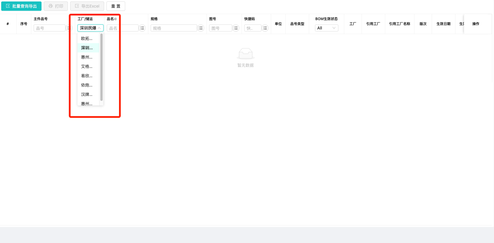
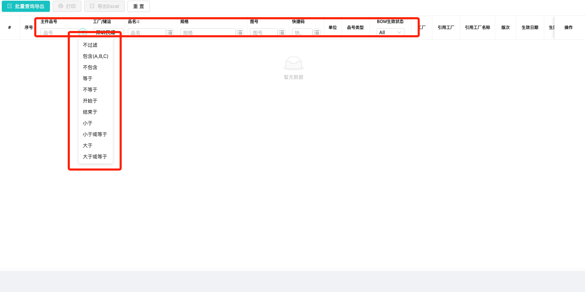
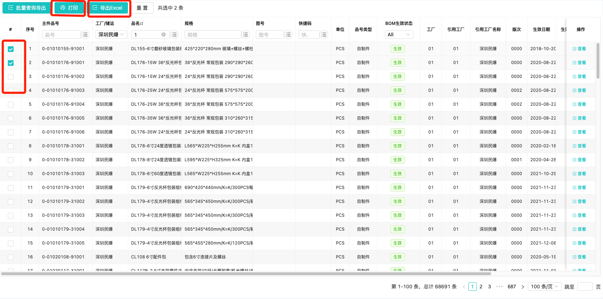
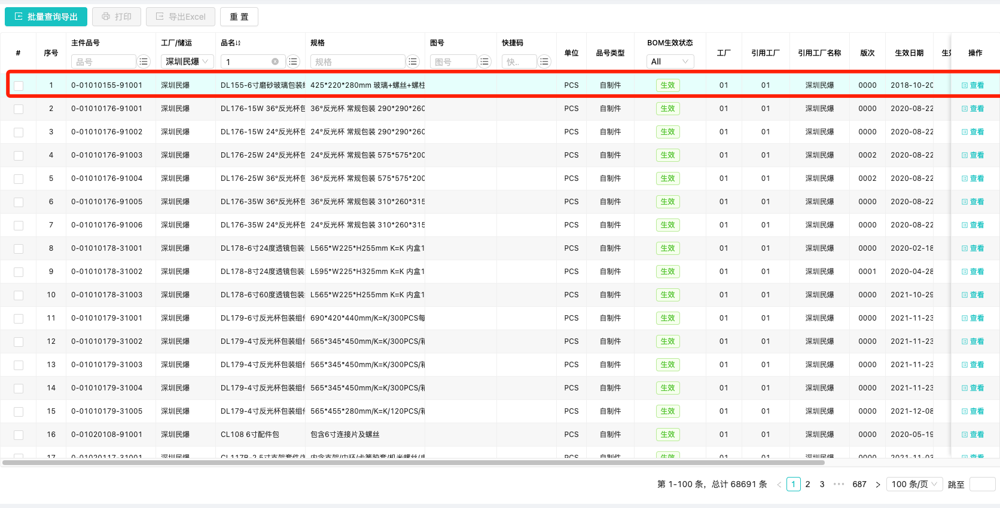
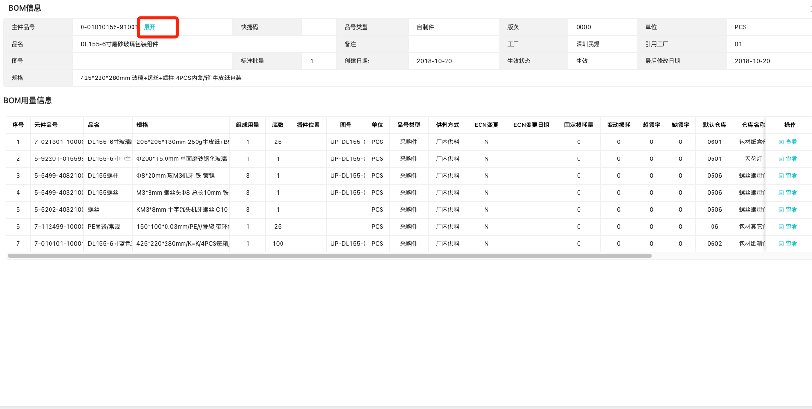
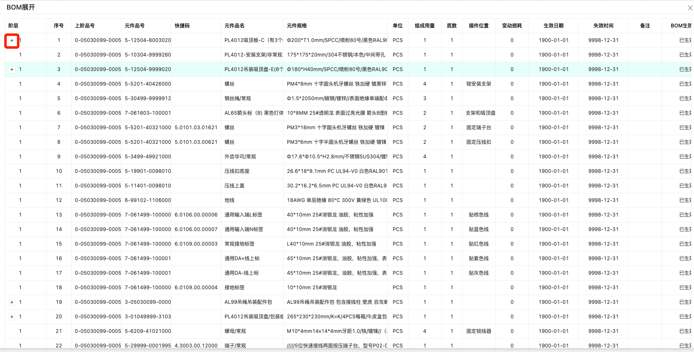

<!--

 * @Author: max
 * @Date: 2022-04-01 09:05:52
 * @LastEditTime: 2022-04-01 09:05:53
 * @LastEditors: max
 * @Description: bom清单
 * @FilePath: /up-admin/docs/erp/list.md
-->

### 搜索

1.选择生产工厂`(进入如果没有可选项,可以联系信息部开通工厂权限)`

2.输入搜索关键字,并且选择搜索条件

### 导出,打印

1.勾选左侧多选框,点击顶部`导出excel``打印`按钮

### 查看Bom详情

1.双击bom

### 查看展阶

1.点击bom详情主件品号旁的`展开`按钮

2.点击左侧`+`按钮,可展开品号信息

