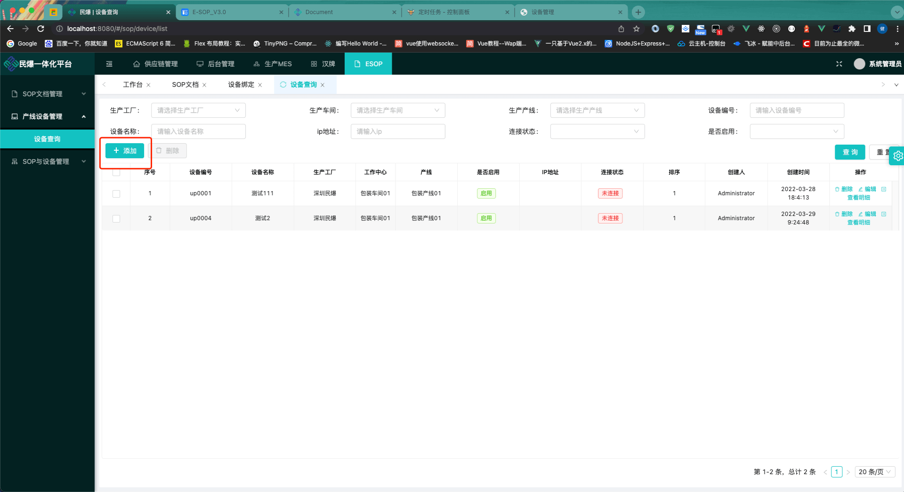
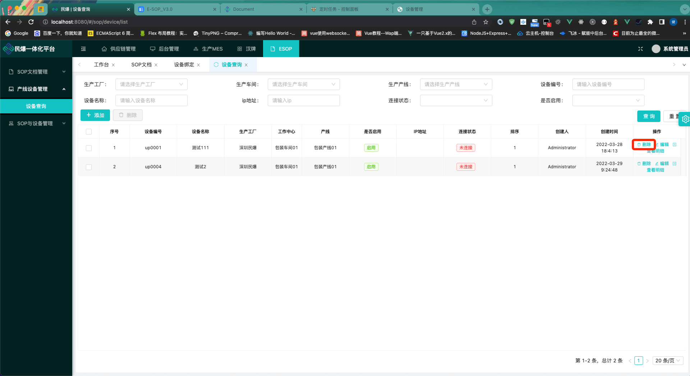
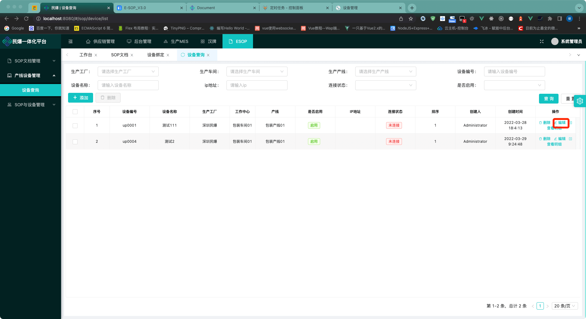
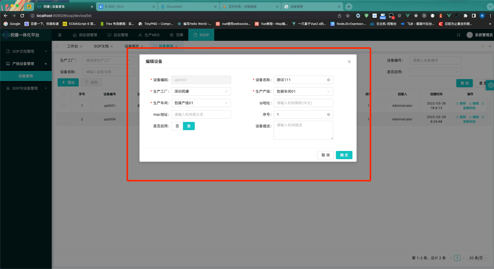

<!--

 * @Author: max
 * @Date: 2022-03-30 10:18:32
 * @LastEditTime: 2022-03-30 16:19:10
 * @LastEditors: max
 * @Description: 
 * @FilePath: /up-admin/docs/esop/device.md
-->
### 添加设备

1.点击`添加`按钮,

2.输入必填内容 `(设备编码,设备名称,生产工厂,生产产线,生产车间)` ,点击确定提交

### 删除设备

1.点击操作菜单`删除`按钮,`(已发布无法删除)`

### 编辑设备

1.点击操作菜单`编辑`按钮,`(已发布无法编辑)`

