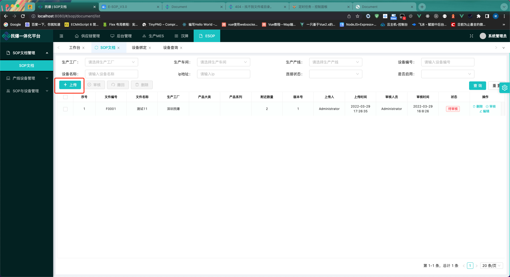

<!--

 * @Author: max
 * @Date: 2022-03-30 10:18:03
 * @LastEditTime: 2022-03-30 16:09:36
 * @LastEditors: max
 * @Description: 
 * @FilePath: /up-admin/docs/esop/docs.md
-->
### 上传sop文档

 1.点击上传按钮

2.填入必填项:文件编码,文件名称,生产工厂,版本号.选择上传附近支持png.jpg.pdf.excel.word文件(最多上传10个附件)

3.点击"确定"提交文档内容

### 编辑sop文档

1.点击操作菜单"编辑"按钮`(已发布,已审核无法修改)`

2.编辑文档内容`(文件编码,版本号无法编辑)`,附件内容如果修改,点击附件右边删除按钮,再次上传附件信息

### 删除sop文档

1.点击操作菜单"删除"按钮`(已发布,已审核无法删除)`

### 审核sop文档

1.点击操作菜单"审核"按钮`(已发布,已审核无法审核)`

